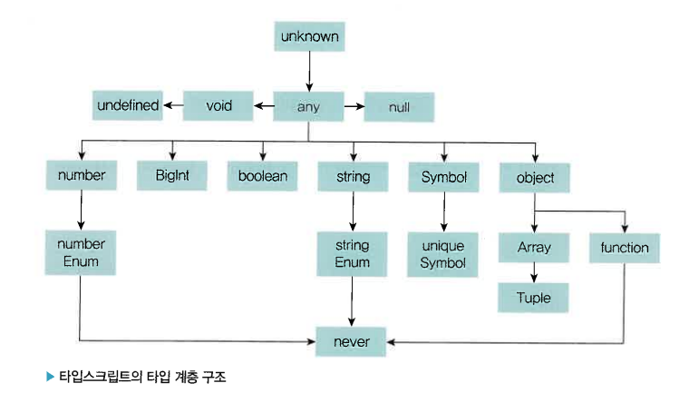

# 3장 고급 타입

# 3.1 타입스크립트만의 독자적 타입 시스템



## 1. any 타입

- 자바스크립트에 존재하는 **모든 값**을 오류 없이 받을 수 있다.


- any 타입은 타입스크립트로 달성하고자 하는 정적 타이핑을 무색하게 만들 수 있기에 지양해야 할 필요가 있다.
- 그러나 어쩔 수 없이 사용해야 할 때가 있는데…

### 개발 단계에서 임시로 값을 지정해야 할 때

- 개발 과정에서 추후 값이 변경될 가능성이 있거나 아직 세부 항목에 대한 타입이 확정되지 않은 경우
- 다른 타입으로 바꾸는 과정이 누락되지 않도록 주의

### 어떤 값을 받아올지 또는 넘겨줄지 정할 수 없을 때

- API 요청 및 응답 처리, 콜백 함수 전달, 파악이 힘든 외부 라이브러리 등 주고받을 값이 명확하지 않을 때

### 값을 예측할 수 없을 때 암묵적으로 사용

- 외부 라이브러리나 웹 API의 요청에 따라 다양한 값을 반환하는 API가 존재하는 경우

## 2. unknown 타입

- 어떤 타입이든 unknown 타입에 할당 가능하지만, any를 제외한 다른 타입에 할당 불가능
- any 타입과 다르게 타입 검사를 강제하고, 타입이 식별된 후 사용할 수 있기 때문에 안전

## 3. void 타입

- 함수에서 아무 값도 반환하지 않는 경우 사용

## 4. never 타입

- 값을 반환할 수 없는 경우 사용

### 에러를 던지는 경우

- 특정 함수 실행 중 에러 던지는 작업 수행 시 해당 함수의 반환 타입은 never

### 무한히 함수가 실행되는 경우

- 함수 내에서 무한 루프 실행 시 값을 반환하지 못하여 반환 타입은 never

- never 타입은 모든 타입의 하위 타입
- never 자신을 제외한, 심지어 any 타입도 never 타입에 할당될 수 없음
- 특정 조건을 만족하지 않은 경우 엄격한 타입 검사 목적으로 never 타입을 명시적으로 사용

## 5. Array 타입

- 배열의 크기는 제한하지 않지만 명시적 타입을 선언하여 해당 타입의 원소를 관리

```tsx
const array:number[] = [1, 2, 3]; // 숫자에 해당하는 원소만 허용
```

### 튜플

- 대괄호 안에 선언하는 타입의 개수가 튜플이 가질 수 있는 원소의 개수


## 6. enum 타입

- 각 멤버에 명시적으로 값을 할당할 수 있고, 할당하지 않는다면 숫자값을 1씩 늘려가며 자동으로 할당


- 관련이 높은 멤버를 모아 문자열 상수처럼 사용하고자 할 때 사용

# 3.2 타입 조합

## 1. 교차 타입

- 여러 타입을 결합하여 하나의 단일 타입으로 생성

```tsx
type Item = {
  id: number;
  name: string;
  price: number;
};

type ItemDiscount = Item & { discount: number; };
```

## 2. 유니온 타입

- A 타입 또는 B 타입 중 하나가 될 수 있는 타입

```tsx
type CardItem = {
  id: number;
  name: string;
  price: number;
  imageUrl: string;
};

type PromotionItem = Item | CardItem;
```

## 3. 인덱스 시그니처

- 특정 타입의 속성 이름은 알 수 없지만 속성값의 타입을 알고 있을 때 사용

```tsx
 interface IndexSignatureEx {
   [key: string]: number;
 }
 // 해당 타입의 속성 키는 모두 string 타입이어야 하고 속성값은 모두 number 타입을 가져야 함
```

## 4. 인덱스드 엑세스 타입

- 다른 타입의 특정 속성이 가지는 타입을 조회하기 위해 사용

```tsx
type Example = {
  a: number;
  b: string;
  c: boolean;
};

type IndexAccess2 = Example["a" | "b"]; // number | string
```

## 5. 맵드 타입

- 다른 타입을 기반으로 한 타입을 선언할 때 사용

```tsx
type Example = {
  a: number;
  b: string;
  c: boolean;
};

type Subset<T> = {
  [K in keyof T]?: T[K];
};

const aExample: Subset<Example> = { a: 3 };
const bExample: Subset<Example> = { b: "hello" };
```

## 6. 템플릿 리터럴 타입

- 자바스크립트의 템플릿 리터럴 문자열 (`${}`) 을 사용하여 문자열 리터럴 타입을 선언

```tsx
type Stage = 
  | "init"
  | "select"
  | "edit"
  | "delete";
type StageName = `${Stage}-stage`;
// 'init-stage' | 'select-stage' | 'edit-stage' | 'delete-stage'
```

## 7. 제네릭

- 내부적으로 사용할 타입을 미리 정해두지 않고 타입 변수를 사용해서 해당 위치를 비워 둔 다음, 실제로 그 값을 사용할 때 외부에서 타입 변수 자리에 타입을 지정하여 사용하는 방식
- 여러 타입에 대해 하나하나 따로 정의하지 않아도 되기 때문에 재사용성이 크게 향상

```tsx
type ExampleArrayType<T> = T[];

const array1: ExampleArrayType<string> = ["치킨", "피자", "우동"];
```

- 제네릭 함수 호출 시 꺾쇠괄호 안에 타입 명시를 생략하면 컴파일러가 인수를 보고 타입을 추론

```tsx
function exampleFunc<T>(arg: T): T[] {
  return new Array(3).fill(arg);
}

exampleFunc("hello"); // T는 string으로 추론된다
```

- 특정 요소 타입을 알 수 없을 땐 제네릭 타입에 기본값을 추가

```tsx
interface SubmitEvent<T = HTMLElement> extends SyntheticEvent<T> { submitter: T; }
// 기본값 HTMLElement
```

<aside>
💡

**주의점!!**
특정 타입에서만 존재하는 멤버를 참조하려고 하면 에러 발생
⇒ 따라서 함수나 클래스 등의 내부에서 제네릭을 사용할 때 어떤 타입이든 될 수 있다는 개념을 잘 알고 있어야 한다

</aside>

# 3.3 제네릭 사용법

## 1. 함수의 제네릭

- 어떤 함수의 매개변수나 반환 값에 다양한 타입을 넣고 싶을 때 사용

```tsx
function ReadOnlyRepository<T>(target: ObjectType<T> | EntitySchma<T> | string);
Repository<T> {
  return getConnection("ro").getRepository(target);
}
```

## 2. 호출 시그니처의 제네릭

- 호출 시그니처 : 타입스크립트의 함수 타입 문법

                                     함수와 매개변수와 반환 타입을 미리 선언

                                     개발자는 함수 호출 시 필요한 타입을 별도로 지정 가능

```tsx
// 사전에 매개변수 반환타입 선언
type GreetFunction = (name: string) => string;

const greet: GreetFunction = (name) => {
    return `안녕하세요, ${name}님!`;
};

console.log(greet("이현성")); // 출력: 안녕하세요, 이현성님!
```

## 3. 제네릭 클래스

- 외부에서 입력된 타입을 클래스 내부에 적용할 수 있는 클래스

```tsx
class Stack<T> {
    private items: T[] = [];

    push(item: T): void {
        this.items.push(item);
    }

    pop(): T | undefined {
        return this.items.pop();
    }

    peek(): T | undefined {
        return this.items[this.items.length - 1];
    }

    size(): number {
        return this.items.length;
    }
}
```

## 4. 제한된 제네릭

- 타입 매개변수에 대한 제약 조건 설정

```tsx
// string 타입으로 제약
type ErrorRecord<Key extends string> = Exclude<Key, ErrorCodeType> extends never
  ? Partial<Record<Key, boolean>>
  : never;
```

- 바운드 타입 매개변수 **:** 타입 매개변수가 특정 타입으로 묶였을 때 키(Key extends string)
- 키의 상한 한계 : string

## 5. 확장된 제네릭

```tsx
// 여러 타입 매개변수를 사용한 제네릭 타입 정의
type MultiParam<Key extends string | number> = {
  [K in Extract<Key, string>]: string;
} & {
  [K in Extract<Key, number>]: number;
};

type MixedTypes = MultiParam<"name" | "age" | 1 | 2>;

const data: MixedTypes = {
  name: "이현성",
  age: "26",
  1: 100,
  2: 200
};

// 타입 검사 예시
function processData(input: MixedTypes) {
  console.log(`이름: ${input.name}`);
  console.log(`나이: ${input.age}`);
  console.log(`숫자1: ${input[1]}`);
  console.log(`숫자2: ${input[2]}`);
}

processData(data);
```

## 6. 제네릭 예시

```tsx
// API 응답 값의 타입 지정
interface ApiResponse<T> {
  data: T;
  status: number;
}

interface User {
  name: string;
  email: string;
}

function fetchUser(): Promise<ApiResponse<User>> {
  return fetch('/api/user').then(res => res.json());
}

fetchUser().then(response => {
  console.log(response.data.name);
});
```

## 💡 제네릭 사용 시 주의점

### 제네릭을 굳이 사용하지 않아도 되는 타입

```tsx
// 목적 의미 없이 제네릭을 사용하지 않은 것과 같은 기능
type GType<T> = T;
type RequirementType = "USE" | "UN_USE" | "NON_SELECT";
interface Order {
  getRequirement(): GType<Requirement>;
}
```

### any 사용하기

```tsx
// any 타입은 모든 타입을 허용하기 때문에 타입을 지정하는 의미가 사라지게 된다.
type ReturnType<T = any> = {
  // ...
};
```

### 가독성을 고려하지 않은 사용

```tsx
// 과한 제네릭 사용으로 인한 가독성 저하
ReturnType<Record<OrderType,Partial<Record<CommonOrderStatus | CommonReturnStatus,
Partial<Record<OrderRoleType, string[]>>>>>>

type CommonStatus = CommonOrderStatus | CommonReturnStatus;

type PartialOrderRole = Partial<Record<OrderRoleType, string[]>>;

type RecordCommonOrder = Record<CommonStatus, PartialOrderRole>;

type RecordOrder = Record<OrderType, Partial<RecordCommonOrder>>;

ReturnType<RecordOrder>;
```