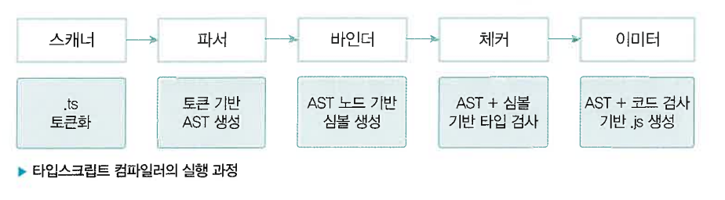

# 타입스크립트 컴파일

## 자바스크립트 런타임과 타입스크립트 컴파일

### 런타임과 컴파일 타임
1. 컴파일 타임
   - 소스코드가 컴파일 과정을 거쳐 컴퓨터가 인식 할수있는 코드로 변환되는 시점

2. 런타임 타임
    - 소스코드의 컴파일이 완료되어 프로그램이 메모리에 적재되어 실행되는 시점

### AST
- 컴파일러가 소스코드를 해석하는 과정에서 생성된 데이터구조
- 어휘적 분석과 구문 분석을 통해 노드단위 트리구조로 구성한다

## 타입스크립트 컴파일러의 동작

### 코드검사기
- 코드에 타입오류가 없는지를 확인
- 컴파일타임에 코드 타입을 확인하기 때문에 코드를 실행하지 않고도 오류를 발견할수있다

### 코드변환기
- 타입을 검사한 다은에 각자의 런타임 환경에서 동작할수있도록 구버전의 자바스크립트로 트랜스파일한다
- 예시로 바벨이라는 자바스크립트 컴파일러가 있다

## 타입스크립트 컴파일러의 구조

1. 스캐너
   - 타입스크립트 소스파일을 어휘적으로 분석하여 토큰을 생성
2. 파서
   - 스캐너가 소스파일을 토큰으로 나누면 해단 토큰을 이용하여  AST를 생성
   - 최상위 노드는 타입스크립트 소스파일이며 최하위는 파일의 끝지점으로 구성
   - 스캐너의 어휘적분석 단위와는 다르게 파서는 구문적 분석을 수행한다
3. 바인더
   - 체커단계에서 타입검사를 할수있도록 기반 마련
   - 타입검사를 위한 심볼이라는 데이터 구조 생성
   - 심볼에 선언된 타입의 노드정보를 저장
4. 체커와 이미터
   - 파서가 생성한 AST와 바인터가 생성한 심볼을 활용하여 타입검사를 수행
   - 체커 : AST의 노드를 탐색하면서 심볼정보를 불러와 소스파일에 대한 타입검사 수행
   - 이미터 : 타입스크립트 소스파일을 변환하는 역할